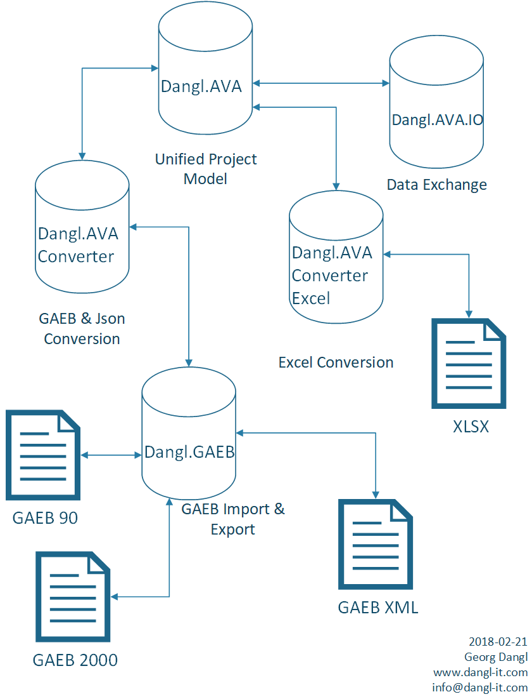

# Dangl.AVA.Examples.Cpp

> An online version of the converter is freely accessible at [my blog](https://blog.dangl.me/gaeb-converter/)  
> A more detailed feature description is available [on the website](https://www.dangl-it.com/products/gaeb-ava-net-library/).

> This project is built with **Visual Studio 2015** for compatibility reasons.

This is a _demonstration_ library intended to show the usage of the Dangl.AVA and Dangl.GAEB projects.
The **Dangl.AVA.Examples.Cpp** shows how to **work with GAEB files in C++**.
To build this solution, you need to copy three packages into the `./localPackages` folder, relative to the root of this project:
* Dangl.AVA
* Dangl.GAEB
* Dangl.AVA.IO

> If you are already a customer with support contract, please see any of the packages documentation on how to set up the official NuGet feed for **DanglIT** packages.

These packages are not included in this repository.
This project is intended to demonstrate the usage of the Dangl.AVA and Dangl.GAEB libraries.
[Please get in touch with us if you are interested in the libraries](https://www.dangl-it.com/contact/?message=I%27m+interested+in+Dangl.GAEB+%26+Dangl.AVA.+Please+contact+me.).

## CLI Interface

The console application is launched via

    Dangl.AVA.Examples.Cpp.exe <InputFile> <OutputFile>

In Visual Studio, you can use the following value as CLI arguments when debugging:

    "$(SolutionDir)\GaebFiles\GAEBXML_DE.X86" "$(SolutionDir)\GaebExport.X86"

## Additional Samples

The C# examples contain additional code: [https://github.com/Dangl-IT/Dangl.AVA.Examples](https://github.com/Dangl-IT/Dangl.AVA.Examples)

## GAEB Example Files

You can find examples of GAEB files in the `GaebFiles` folder in the solution root directory. They are available in German **DE** or English **EN** language and come in
all three formats - GAEB 90, GAEB 2000 and GAEB XML.

## Library Key Features

* Can read all GAEB90, GAEB2000 and GAEB XML files. The GAEB library includes a lot of code that can recover from errors that were found in files out in the wild
* Hassle-free import: Just pass the `Stream` of the file to the converter, format detection and error recovery happens automatically
* All libraries are available with both .Net and NETStandard targets, making them usable on virtually all platforms (for example on Windows, Linux, Mac and Xamarin)
* **Dangl.GAEB** provides a native interface to all features of GAEB files, allowing native operation directly on the GAEB file
* **Dangl.AVA** offers a unified data model that can be bi-directionally imported or exported to via **Dangl.AVA.Converter** between GAEB, Excel and Json
* Advanced heuristics allow the preservation of most information even when converting to an earlier version of the GAEB standard
* Complete `INotifyPropertyChanged` support in **Dangl.AVA** and event driven messaging makes it directly usable in front end applications - Set the price of an item and the whole bill of quantity is automatically updated
* Over **175.000** tests are run automatically on every commit. The tests cover 7 frameworks (both full .Net and .Net Core) and over 200 GAEB files

## Structure

